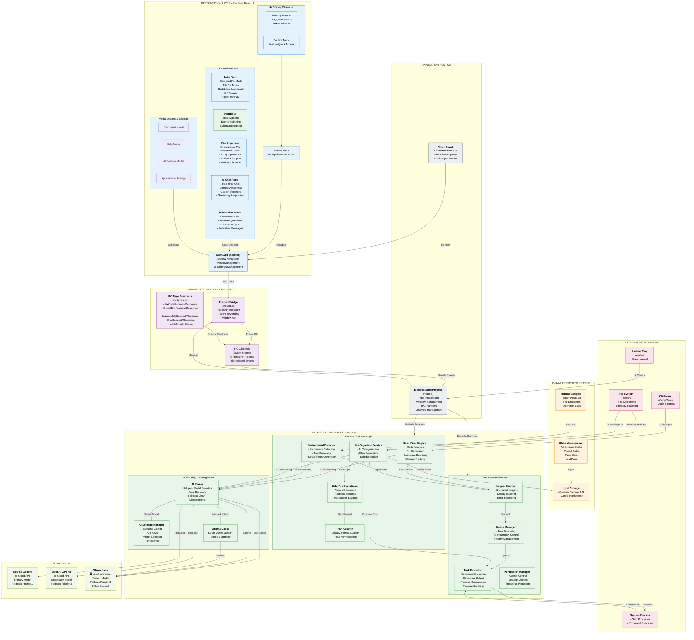

# DevOS Lite - Complete System Architecture

## Overview
DevOS Lite is an Electron-based desktop assistant with a Shimeji floating UI that provides 5 core features for developer workflows, powered by multi-model AI with intelligent fallback mechanisms.

---

## Architecture Diagram (Complete System)



---

## Key Architecture Patterns

### 1. **Layered Architecture (5-Layer Model)**
- **Presentation Layer**: React UI components with state management
- **Communication Layer**: IPC bridge with type-safe contracts
- **Business Logic Layer**: Feature services and AI routing
- **Data Layer**: State persistence and rollback mechanisms
- **Integration Layer**: External systems (File system, APIs, Process management)

### 2. **5 Core Features with Unified Architecture**

#### **Feature 1: Code Fixer** 
- **Input**: Clipboard code, file code, or full codebase
- **Processing**: Analyzes, generates fixes via AI
- **Output**: Diff preview, applies fixes, provides explanations
- **Models**: Gemini → OpenAI → Ollama fallback chain

#### **Feature 2: Environment Builder**
- **Input**: Project path selection
- **Processing**: Scans for frameworks (Node/Python/Java/Rust/Go)
- **Output**: Setup steps, missing tools, environment variables
- **Intelligence**: Framework-specific detection, platform detection

#### **Feature 3: File Organizer**
- **Input**: Folder path + organization rules (AI or custom)
- **Processing**: Categorizes files via AI, generates safe plan
- **Output**: Preview moves, applies atomically, supports rollback
- **Safety**: Transaction logging, rollback metadata, dry-run mode

#### **Feature 4: AI Chat Repo**
- **Input**: User messages + project context
- **Processing**: Understands codebase structure, provides relevant answers
- **Output**: Streaming responses, code references
- **Context**: Loads files, maintains conversation history

#### **Feature 5: Discussion Room**
- **Input**: Multi-user chat messages
- **Processing**: Socket.io based real-time sync
- **Output**: Persistent messages, room management
- **Features**: User presence, message history, collaborative space

### 3. **Multi-Model AI with Intelligent Fallback**
```
User Request → AI Router
    ├─ Try Primary: Google Gemini 2.0 Flash
    │   └─ ✓ Success → Return
    │   └─ ✗ Fail → Fallback
    ├─ Try Secondary: OpenAI GPT-4o
    │   └─ ✓ Success → Return
    │   └─ ✗ Fail → Fallback
    └─ Try Tertiary: Ollama (Local)
        └─ ✓ Success → Return
        └─ ✗ Fail → Error
```

### 4. **IPC Contract Safety**
- All requests/responses inherit from `IPCRequestBase` / `IPCResponseBase`
- RequestId tracking for async correlation
- Timeout configuration
- Standardized error handling with error codes

### 5. **Safe File Operations Pattern**
- Dry-run preview generation first
- Atomic transactions with rollback metadata
- Operation logging for debugging
- Safe executor validates before execution

---

## Data Flow Examples

### **Code Fixer Flow**
1. User enters code in UI → calls `window.electronAPI.fixCode(request)`
2. Renderer sends IPC message to main process
3. Main process routes to AI Router
4. AI Router tries Gemini → OpenAI → Ollama
5. Result streamed back via IPC
6. UI displays diff, user reviews
7. On apply: change persisted, logged, explainable

### **File Organizer Flow**
1. User selects folder → calls `window.electronAPI.organizeFile(request)`
2. Preload forwards to main process
3. Main generates AI-based organization plan
4. Plan adapter normalizes legacy format
5. Safe executor creates transaction preview
6. UI displays moves in preview mode
7. On apply: Safe executor writes changes + rollback metadata
8. On rollback: Reads metadata, restores original files

### **Environment Builder Flow**
1. User selects project → calls `window.electronAPI.detectEnv(projectPath)`
2. Task executor scans directory structure
3. Detects frameworks by package.json, requirements.txt, pom.xml, Cargo.toml
4. AI generates platform-specific setup steps
5. Queue manager manages execution
6. UI displays detection results + setup guidance
7. Optional: User triggers setup (executes commands)

---

## Technology Stack

| Layer | Technology | Purpose |
|-------|-----------|---------|
| **Frontend** | React 19, TypeScript, Tailwind CSS | UI rendering, styling |
| **Desktop** | Electron 33, Vite 6 | App shell, build tool |
| **IPC** | Electron IPC (preload.ts) | Process communication |
| **AI** | Gemini 2.0, OpenAI GPT-4o, Ollama | Intelligence layer |
| **State** | React Hooks, localStorage | State management |
| **File Ops** | fs-extra | Safe file operations |
| **Process** | child_process, p-queue | Task execution |
| **Real-time** | Socket.io | Discussion room sync |
| **UI Components** | Lucide icons, Motion | Icons, animations |
| **Type Safety** | TypeScript 5.8 | Compile-time safety |

---

## Key Quality Attributes

| Attribute | Implementation |
|-----------|----------------|
| **Reliability** | Fallback chain, error recovery, rollback support |
| **Safety** | IPC contracts, dry-run mode, transaction logging |
| **Performance** | Streaming responses, queue management, caching |
| **Maintainability** | Layered architecture, type safety, modular features |
| **Security** | Preload bridge, permission checks, key isolation |
| **Offline** | Ollama local support, no cloud required |
| **Extensibility** | Feature plugin pattern, AI router pluggable |

---

## Cross-Cutting Concerns

1. **Error Handling**: Structured error codes, fallback mechanisms
2. **Logging**: Centralized logger service with debug tracking
3. **Security**: Permission manager, API key isolation, safe file ops
4. **Performance**: Queue manager, timeout management, streaming
5. **State**: Persistent UI settings, project paths, panel geometry

---

## Deployment Architecture

```
┌─────────────────────────────┐
│   Source Code (TypeScript)  │
│  - main.ts                  │
│  - preload.ts               │
│  - src/                     │
└──────────────┬──────────────┘
               │
               ▼
┌─────────────────────────────┐
│  Build & Compile            │
│  - tsc (TS → JS)            │
│  - Vite (React build)       │
│  - Java/Maven (if needed)   │
└──────────────┬──────────────┘
               │
               ▼
┌─────────────────────────────┐
│  Test & Verify              │
│  - Type checking            │
│  - Feature tests            │
│  - Sample validation        │
└──────────────┬──────────────┘
               │
               ▼
┌─────────────────────────────┐
│  Electron Packaging         │
│  - Main + Preload JS        │
│  - Vite dist/               │
│  - Assets                   │
└──────────────┬──────────────┘
               │
               ▼
┌─────────────────────────────┐
│  Distribution               │
│  - Windows .exe             │
│  - macOS .dmg               │
│  - Linux AppImage           │
└─────────────────────────────┘
```

---

## Future Extensibility

The architecture supports:
- **New AI Models**: Add to fallback chain via AI Router
- **New Features**: Create feature service + IPC contracts + UI overlay
- **New AI Backends**: Implement client + integrate to router
- **Custom Workflows**: Extend task executor and queue manager
- **Plugin System**: Feature registration and dynamic loading

