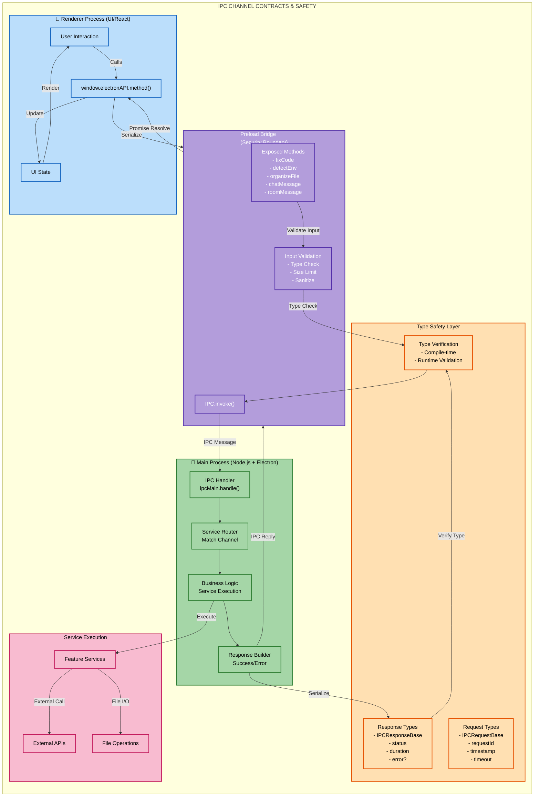
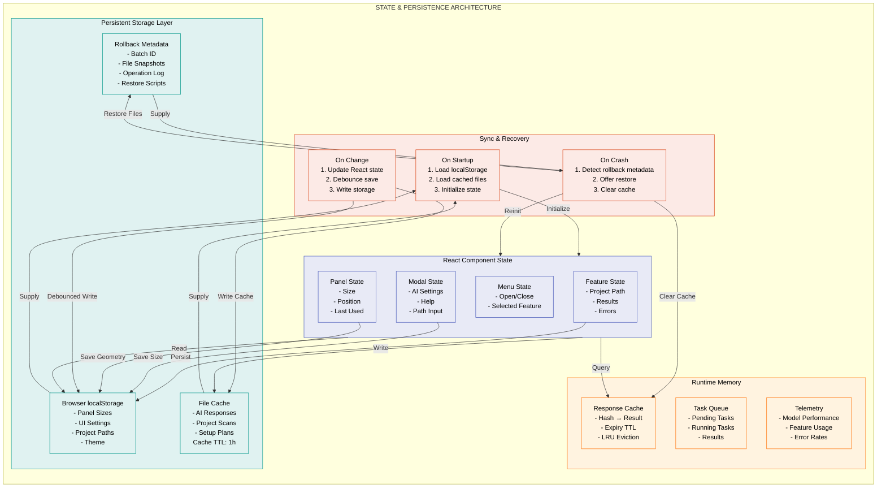
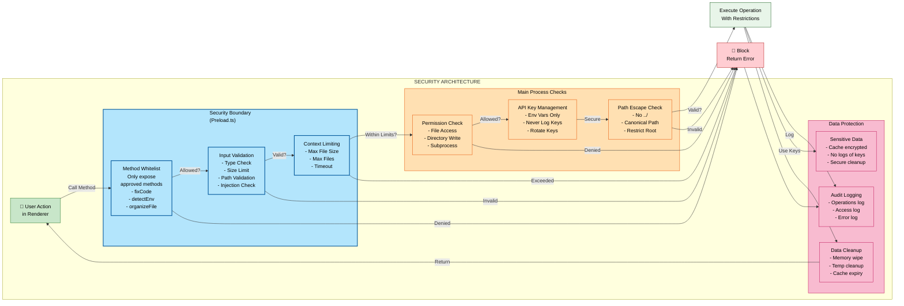
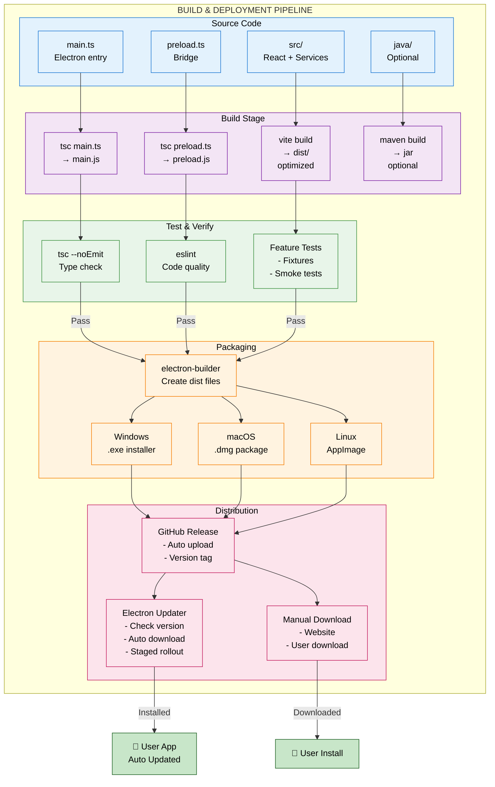
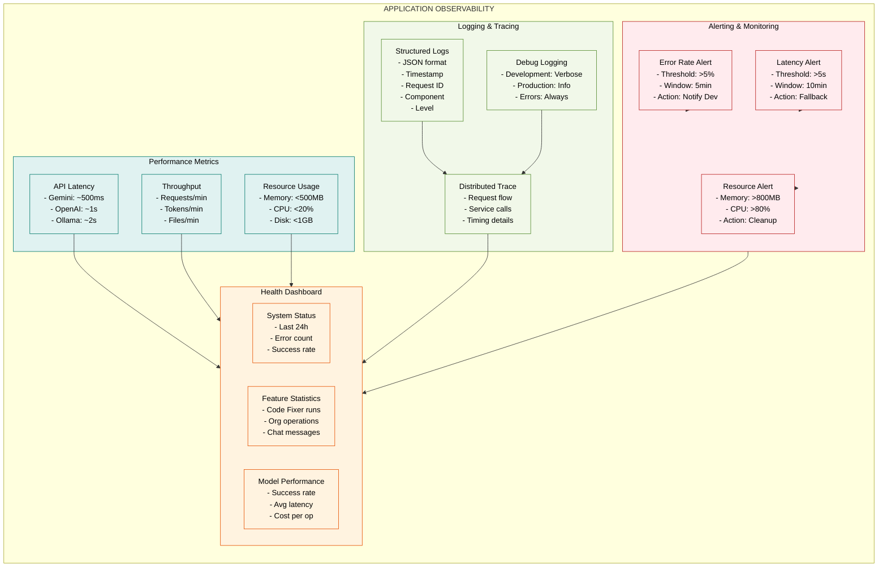

# DevOS Lite - Detailed System Architecture (Extended)

## Part 1: Detailed Feature Interaction Architecture

```mermaid
graph LR
    subgraph "FEATURE ORCHESTRATION"
        direction LR
        
        subgraph CF_DETAIL["Code Fixer - Detailed Flow"]
            CF_IN["Input Handler<br/>- Clipboard<br/>- File<br/>- Codebase"]
            CF_PARSE["Code Parser<br/>- Language Detection<br/>- Syntax Validation"]
            CF_AI["AI Fix Generator<br/>- Problem Analysis<br/>- Fix Generation<br/>- Explanation"]
            CF_APPLY["Apply Engine<br/>- Diff Preview<br/>- Atomic Apply<br/>- Rollback Support"]
        end
        
        subgraph EB_DETAIL["Environment Builder - Detailed Flow"]
            EB_SCAN["Project Scanner<br/>- File Discovery<br/>- Pattern Matching<br/>- Size Optimization"]
            EB_DETECT["Framework Detector<br/>- package.json→Node<br/>- requirements.txt→Python<br/>- pom.xml→Java<br/>- Cargo.toml→Rust<br/>- go.mod→Go"]
            EB_PLAN["Setup Planner<br/>- Tool Detection<br/>- Version Check<br/>- Step Generation<br/>- Platform Variant"]
        end
        
        subgraph FO_DETAIL["File Organizer - Detailed Flow"]
            FO_CATALOG["File Cataloging<br/>- Extension Analysis<br/>- Path Parsing<br/>- Size Calculation"]
            FO_CATEGORIZE["Categorization Engine<br/>- AI Categorization<br/>- Rule Matching<br/>- Custom Rules"]
            FO_PLAN["Organization Planner<br/>- Move Generation<br/>- Dir Creation<br/>- Conflict Detection"]
            FO_EXECUTE["Safe Executor<br/>- Dry-run Preview<br/>- Atomic Execution<br/>- Rollback Metadata"]
        end
        
        subgraph CC_DETAIL["Codebase Chat - Detailed Flow"]
            CC_INDEX["Code Indexing<br/>- File Enumeration<br/>- Structure Analysis<br/>- Symbol Extraction"]
            CC_CONTEXT["Context Builder<br/>- Query Understanding<br/>- File Selection<br/>- Relevance Ranking"]
            CC_RESPOND["Response Generator<br/>- Code References<br/>- Explanation<br/>- Streaming Output"]
        end
        
        subgraph DR_DETAIL["Discussion Room - Detailed Flow"]
            DR_SESSION["Session Manager<br/>- Room Creation<br/>- User Management<br/>- State Sync"]
            DR_MESSAGE["Message Pipeline<br/>- Message Validation<br/>- Timestamp<br/>- User Context"]
            DR_SYNC["Real-time Sync<br/>- Socket.io Broadcast<br/>- History Store<br/>- User Presence"]
        end
    end
    
    CF_IN → CF_PARSE → CF_AI → CF_APPLY
    EB_SCAN → EB_DETECT → EB_PLAN
    FO_CATALOG → FO_CATEGORIZE → FO_PLAN → FO_EXECUTE
    CC_INDEX → CC_CONTEXT → CC_RESPOND
    DR_SESSION → DR_MESSAGE → DR_SYNC
    
    classDef cfeatdetail fill:#BBDEFB,stroke:#1565C0,color:#000
    classDef ebfeatdetail fill:#C8E6C9,stroke:#2E7D32,color:#000
    classDef fofeatdetail fill:#FFE0B2,stroke:#E65100,color:#000
    classDef ccfeatdetail fill:#F8BBD0,stroke:#C2185B,color:#000
    classDef drfeatdetail fill:#E1BEE7,stroke:#6A1B9A,color:#000
    
    class CF_DETAIL,CF_IN,CF_PARSE,CF_AI,CF_APPLY cfeatdetail
    class EB_DETAIL,EB_SCAN,EB_DETECT,EB_PLAN ebfeatdetail
    class FO_DETAIL,FO_CATALOG,FO_CATEGORIZE,FO_PLAN,FO_EXECUTE fofeatdetail
    class CC_DETAIL,CC_INDEX,CC_CONTEXT,CC_RESPOND ccfeatdetail
    class DR_DETAIL,DR_SESSION,DR_MESSAGE,DR_SYNC drfeatdetail
```

---

## Part 2: AI Routing & Fallback Intelligence

```mermaid
graph TB
    subgraph "AI REQUEST PROCESSING PIPELINE"
        direction TB
        
        REQ["User Request<br/>- Code Fix<br/>- Plan Generation<br/>- Chat Response"]
        
        subgraph ROUTER["AI Router Decision Engine"]
            STATUS_CHECK["Check Backend Status<br/>- API Keys Present?<br/>- Service Healthy?<br/>- Rate Limit Status?"]
            STATS["Model Statistics<br/>- Success Rate<br/>- Avg Response Time<br/>- Last Error"]
            SELECT["Model Selection<br/>- Primary: Gemini<br/>- Secondary: OpenAI<br/>- Fallback: Ollama"]
        end
        
        subgraph EXEC["Execution Phase"]
            TRY1["Try Model 1<br/>Timeout: 30s<br/>Retry: 1"]
            RESULT1{Success?}
            TRY2["Try Model 2<br/>Timeout: 30s<br/>Retry: 1"]
            RESULT2{Success?}
            TRY3["Try Model 3<br/>Timeout: 30s<br/>No Retry"]
            RESULT3{Success?}
        end
        
        subgraph RESPONSE["Response Handling"]
            SUCCESS["✓ Success<br/>- Return Result<br/>- Update Stats<br/>- Log Duration"]
            PARTIAL["⚠ Partial<br/>- Return Partial<br/>- Mark Incomplete"]
            FALLBACK["→ Fallback<br/>- Update Error Log<br/>- Try Next"]
            FAIL["✗ Failure<br/>- Return Error<br/>- Suggest Manual"]
        end
        
        subgraph OPTIMIZE["Optimization & Learning"]
            CACHE["Response Cache<br/>- Hash Input<br/>- Cache Duration: 1h"]
            METRICS["Track Metrics<br/>- Success Rate<br/>- Token Usage<br/>- Cost Analysis"]
            FEEDBACK["User Feedback<br/>- Satisfaction<br/>- Model Preference"]
        end
    end
    
    REQ → STATUS_CHECK
    STATUS_CHECK → STATS
    STATS → SELECT
    SELECT → TRY1
    TRY1 → RESULT1
    RESULT1 -->|✓| SUCCESS
    RESULT1 -->|✗| FALLBACK
    FALLBACK → TRY2
    TRY2 → RESULT2
    RESULT2 -->|✓| SUCCESS
    RESULT2 -->|✗| FALLBACK
    FALLBACK → TRY3
    TRY3 → RESULT3
    RESULT3 -->|✓| SUCCESS
    RESULT3 -->|✗| FAIL
    
    SUCCESS → CACHE
    SUCCESS → METRICS
    PARTIAL → METRICS
    FAIL → FEEDBACK
    
    CACHE --> OUTPUT["📤 Response to UI"]
    METRICS --> OUTPUT
    FEEDBACK --> OUTPUT
    
    classDef router fill:#FFF9C4,stroke:#F57F17,color:#000,stroke-width:2px
    classDef exec fill:#E0F2F1,stroke:#00796B,color:#000,stroke-width:2px
    classDef response fill:#F1F8E9,stroke:#558B2F,color:#000,stroke-width:2px
    classDef optimize fill:#FCE4EC,stroke:#AD1457,color:#000,stroke-width:2px
    classDef decision fill:#FFE082,stroke:#F57C00,color:#000,stroke-width:2px
    
    class ROUTER,STATUS_CHECK,STATS,SELECT router
    class EXEC,TRY1,TRY2,TRY3 exec
    class RESPONSE,SUCCESS,PARTIAL,FALLBACK,FAIL response
    class OPTIMIZE,CACHE,METRICS,FEEDBACK optimize
    class RESULT1,RESULT2,RESULT3 decision
```

---

## Part 3: IPC Communication Contract Map



---

## Part 4: Data Persistence & State Management



---

## Part 5: Error Handling & Recovery Flow

```mermaid
graph TB
    subgraph "ERROR HANDLING & RESILIENCE"
        direction TB
        
        ERROR["⚠️ Error Occurs"]
        
        subgraph DETECTION["Error Detection"]
            CLASSIFY["Error Classification<br/>- API Error<br/>- Network Error<br/>- File Error<br/>- Timeout<br/>- Permission"]
            SEVERITY["Severity Level<br/>- CRITICAL<br/>- HIGH<br/>- MEDIUM<br/>- LOW<br/>- INFO"]
        end
        
        subgraph HANDLING["Error Handling Strategy"]
            RETRY["Retry Logic<br/>- Exponential Backoff<br/>- Max 3 Attempts<br/>- 1s, 2s, 4s"]
            FALLBACK["Model Fallback<br/>- Try Next Model<br/>- Different Approach<br/>- Local Alternative"]
            CACHE["Cache Fallback<br/>- Use Cached Result<br/>- Stale Data OK?<br/>- Notify User"]
            MANUAL["Manual Intervention<br/>- Suggest Manual Fix<br/>- Collect Input<br/>- Save for Learning"]
        end
        
        subgraph LOGGING["Logging & Analytics"]
            LOG_FILE["Log to File<br/>- Timestamp<br/>- Context<br/>- Stack Trace<br/>- Recovery Action"]
            TELEMETRY["Send Telemetry<br/>- Error Type<br/>- Frequency<br/>- Recovery Success"]
            USER_FEEDBACK["User Notification<br/>- Error Message<br/>- Suggested Action<br/>- Contact Support"]
        end
        
        subgraph RECOVERY["Recovery Actions"]
            RECOVER_STATE["State Recovery<br/>- Reset State<br/>- Clear Cache<br/>- Reload UI"]
            RECOVER_DATA["Data Recovery<br/>- Rollback Changes<br/>- Restore Files<br/>- Undo Operations"]
            RECOVER_PROCESS["Process Recovery<br/>- Restart Worker<br/>- Reconnect API<br/>- Reinit Queue"]
        end
    end
    
    ERROR → CLASSIFY
    CLASSIFY → SEVERITY
    SEVERITY -->|API Error| RETRY
    SEVERITY -->|Network| FALLBACK
    SEVERITY -->|File| RECOVER_DATA
    SEVERITY -->|Critical| RECOVER_STATE
    
    RETRY -->|Success| RESOLVE["✓ Resolved"]
    RETRY -->|Failed| FALLBACK
    FALLBACK -->|Success| RESOLVE
    FALLBACK -->|Failed| CACHE
    CACHE -->|Found| RESOLVE
    CACHE -->|Not Found| MANUAL
    MANUAL -->|User Input| RESOLVE
    MANUAL -->|Deferred| PENDING["⏳ Pending"]
    
    RESOLVE → LOG_FILE
    PENDING → LOG_FILE
    LOG_FILE → TELEMETRY
    TELEMETRY → USER_FEEDBACK
    USER_FEEDBACK →|Notify User| SUCCESS["✓ Complete<br/>User Informed"]
    
    ERROR -->|Data Danger| RECOVER_DATA
    ERROR -->|State Danger| RECOVER_STATE
    ERROR -->|Process Danger| RECOVER_PROCESS
    RECOVER_DATA → LOG_FILE
    RECOVER_STATE → LOG_FILE
    RECOVER_PROCESS → LOG_FILE
    
    classDef error fill:#FFEBEE,stroke:#C62828,color:#000,stroke-width:2px
    classDef detection fill:#FFF3E0,stroke:#E65100,color:#000
    classDef handling fill:#E3F2FD,stroke:#1565C0,color:#000
    classDef logging fill:#F3E5F5,stroke:#6A1B9A,color:#000
    classDef recovery fill:#E8F5E9,stroke:#2E7D32,color:#000
    classDef success fill:#C8E6C9,stroke:#1B5E20,color:#000,stroke-width:2px
    
    class ERROR error
    class DETECTION,CLASSIFY,SEVERITY detection
    class HANDLING,RETRY,FALLBACK,CACHE,MANUAL handling
    class LOGGING,LOG_FILE,TELEMETRY,USER_FEEDBACK logging
    class RECOVERY,RECOVER_STATE,RECOVER_DATA,RECOVER_PROCESS recovery
    class RESOLVE,PENDING,SUCCESS success
```

---

## Part 6: Security & Access Control



---

## Part 7: Deployment & Distribution Architecture



---

## Part 8: Component Dependency Matrix

| Component | Depends On | Used By | Criticality |
|-----------|-----------|---------|------------|
| **App.tsx** | React, Event Bus, IPC Types | Shimeji, Menus, Features | CRITICAL |
| **AI Router** | Settings Manager, Ollama Client | All Features | CRITICAL |
| **Code Fixer Service** | AI Router, Task Executor | Code Fixer UI | HIGH |
| **File Organizer Service** | AI Router, Safe Executor | File Organizer UI | HIGH |
| **Environment Detector** | AI Router, Task Executor | Environment UI | MEDIUM |
| **Codebase Chat** | AI Router, Event Bus | Chat UI | MEDIUM |
| **Discussion Room** | Socket.io, Event Bus | Room UI | LOW |
| **Preload Bridge** | Electron IPC | All Services | CRITICAL |
| **IPC Types** | TypeScript | Preload, Main | CRITICAL |
| **Task Executor** | Queue Manager, Child Process | Services | HIGH |
| **Safe File Executor** | Rollback DB, File System | File Organizer | HIGH |
| **Logger** | File System | All Services | MEDIUM |
| **Permission Manager** | None | Services | HIGH |
| **Event Bus** | None | App, Services | MEDIUM |

---

## Part 9: Runtime Metrics & Monitoring



---

## Key Takeaways

1. **Modularity**: Each feature is self-contained but shares core services
2. **Resilience**: Multi-layer error handling with fallback mechanisms
3. **Safety**: IPC contracts prevent runtime errors, preload boundary ensures security
4. **Observability**: Comprehensive logging, metrics, and tracing
5. **Extensibility**: New features can be added following the established patterns
6. **Performance**: Streaming responses, caching, and smart queuing
7. **Reliability**: Transaction logging, rollback support, crash recovery

