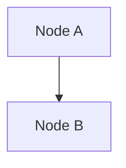

# Exporting Architecture Diagrams - Complete Guide

## 📊 Overview

All architecture diagrams in this documentation are created using **Mermaid**, a JavaScript-based diagramming and charting tool. This guide shows you how to export them to various formats (PNG, SVG, PDF, etc.).

---

## ✅ Method 1: Mermaid Live Editor (Easiest, No Installation)

### Step 1: Open Mermaid Live Editor
1. Go to https://mermaid.live/
2. You'll see a blank editor

### Step 2: Copy Diagram Code
1. Open [ARCHITECTURE.md](../ARCHITECTURE.md) or [ARCHITECTURE_EXTENDED.md](../ARCHITECTURE_EXTENDED.md)
2. Find the diagram you want to export
3. Copy the code block between the triple backticks:
   ```
   ```mermaid
   [COPY FROM HERE TO HERE]
   ```
   ```

### Step 3: Paste & Export
1. Paste the code into the Mermaid Live Editor
2. The diagram will render immediately
3. Click the **Download** button at the top right
4. Choose format:
   - **SVG** (vector, best quality, editable)
   - **PNG** (raster, good for presentations)
   - **PDF** (for printing/sharing)

### Pro Tips
- 🔍 Use zoom controls to preview
- 📐 Adjust diagram width/height in the "Configuration" panel
- 🎨 Change themes (light/dark) in settings
- 💾 Save your work using the cloud save feature

---

## 🖥️ Method 2: VS Code with Extensions (Local, Integrated)

### Step 1: Install Mermaid Extension
1. Open VS Code
2. Go to Extensions (Ctrl+Shift+X)
3. Search for "Markdown Preview Mermaid Support"
4. Click Install (by Matt Bierner)

### Step 2: Open Markdown File
1. Open any `.md` file with diagrams (ARCHITECTURE.md)
2. Click "Preview" button (top right) or press Ctrl+Shift+V
3. Mermaid diagrams will render in the preview

### Step 3: Export from Preview
1. Right-click on the diagram in preview
2. Select "Save Image As"
3. Choose location and format (PNG/SVG)

### Alternative: Direct Export
```bash
# Using Mermaid CLI (see Method 3)
```

### Pro Tips
- 📝 Edit `.md` and see live preview
- 🔄 Auto-refresh when you save
- 💡 Supports dark/light theme
- 📌 Markdown preview stays in sync

---

## 🛠️ Method 3: Mermaid CLI (Command Line, Batch Export)

### Step 1: Install Mermaid CLI
```bash
npm install -g @mermaid-js/mermaid-cli
# or with yarn
yarn global add @mermaid-js/mermaid-cli
```

### Step 2: Verify Installation
```bash
mmdc --version
# Output: @mermaid-js/mermaid-cli@10.x.x
```

### Step 3: Export Single Diagram
```bash
# PNG export
mmdc -i ARCHITECTURE.md -o ARCHITECTURE.png

# SVG export
mmdc -i ARCHITECTURE.md -o ARCHITECTURE.svg

# PDF export (requires Chromium)
mmdc -i ARCHITECTURE.md -o ARCHITECTURE.pdf
```

### Step 4: Batch Export All Diagrams
```bash
# Export all .md files to PNG
for file in *.md; do
  mmdc -i "$file" -o "${file%.md}.png"
done

# Or use PowerShell on Windows
Get-ChildItem -Filter "*.md" | ForEach-Object {
  mmdc -i $_.FullName -o $_.FullName.Replace(".md", ".png")
}
```

### Options
```bash
# Custom width/height
mmdc -i input.md -o output.png -w 1600 -H 1200

# Scale (zoom)
mmdc -i input.md -o output.png -s 2

# Specific theme
mmdc -i input.md -o output.png -t light
# Themes: default, dark, forest, neutral, base

# Puppeteer config (for complex diagrams)
mmdc -i input.md -o output.png --puppeteerConfig puppeteer.json

# Background color
mmdc -i input.md -o output.png --backgroundColor white
```

### Pro Tips
- 🚀 Use `-t dark` for presentations
- 📐 Adjust `-w` and `-H` for custom sizes
- 🎨 Try different themes with `-t`
- 💻 Use batch scripts for all diagrams

---

## 🎨 Method 4: Inline SVG (Embedding in Web)

### For Web Pages
If you want to embed diagrams directly in HTML:

```html
<!-- Include Mermaid library -->
<script src="https://cdn.jsdelivr.net/npm/mermaid/dist/mermaid.min.js"></script>
<script>mermaid.contentLoaded();</script>

<!-- Embed diagram -->
<div class="mermaid">
  graph TB
    A["Node A"]
    B["Node B"]
    A --> B
</div>
```

### For Markdown Documents
Use this in your markdown:

````markdown

````

---

## 🔄 Method 5: PlantUML Conversion (Alternative Format)

If you need PlantUML format instead:

1. Use https://mermaid.live/
2. Export as SVG
3. Convert SVG to PlantUML using online converters

Or use this script to convert:
```bash
# Install converter
npm install -g mermaid-to-plantuml

# Convert
mermaid-to-plantuml ARCHITECTURE.md > ARCHITECTURE.puml
```

---

## 📋 Architecture Diagrams Available

### In ARCHITECTURE.md
1. **Main System Architecture** - Complete system overview
   - Recommended format: **PNG** (presentations) or **SVG** (editing)
   - Size: 1400x1000+ (landscape)

### In ARCHITECTURE_EXTENDED.md
1. **Part 1: Feature Interaction Architecture**
   - Recommended format: **SVG** (for detailed inspection)

2. **Part 2: AI Routing & Fallback Intelligence**
   - Recommended format: **PNG** (for presentations)

3. **Part 3: IPC Communication Contract Map**
   - Recommended format: **SVG** (technical reference)

4. **Part 4: Data Persistence & State Management**
   - Recommended format: **PNG** (documentation)

5. **Part 5: Error Handling & Recovery Flow**
   - Recommended format: **SVG** (detailed analysis)

6. **Part 6: Security & Access Control**
   - Recommended format: **PNG** (security review)

7. **Part 7: Deployment & Distribution Architecture**
   - Recommended format: **PNG** (team reference)

8. **Part 8: Component Dependency Matrix**
   - Format: **Table** (included in markdown)

9. **Part 9: Runtime Metrics & Monitoring**
   - Recommended format: **PNG** (dashboard reference)

---

## 📐 Recommended Export Sizes

| Use Case | Format | Width | Height | Scale |
|----------|--------|-------|--------|-------|
| **Presentation** | PNG | 1600 | 1200 | 2x |
| **Documentation** | SVG | 1400 | 1000 | 1x |
| **Printing** | PDF | 1920 | 1440 | 2x |
| **Web** | SVG | 1200 | 900 | 1x |
| **Mobile** | PNG | 800 | 600 | 1x |

---

## 🎯 Quick Export Commands

### Export to PNG (High Quality)
```bash
mmdc -i ARCHITECTURE.md -o diagrams/ARCHITECTURE.png -s 2 -w 1600
```

### Export to SVG (Editable)
```bash
mmdc -i ARCHITECTURE.md -o diagrams/ARCHITECTURE.svg
```

### Export to PDF (Printing)
```bash
mmdc -i ARCHITECTURE.md -o diagrams/ARCHITECTURE.pdf -s 2 -w 1920
```

### Export All at Once
```bash
mkdir -p diagrams/png diagrams/svg
mmdc -i ARCHITECTURE.md -o diagrams/png/ARCHITECTURE.png -s 2
mmdc -i ARCHITECTURE.md -o diagrams/svg/ARCHITECTURE.svg
mmdc -i ARCHITECTURE_EXTENDED.md -o diagrams/png/ARCHITECTURE_EXTENDED.png -s 2
mmdc -i ARCHITECTURE_EXTENDED.md -o diagrams/svg/ARCHITECTURE_EXTENDED.svg
```

---

## 🎨 Customization Options

### Theme Selection
```bash
# Light theme (default)
mmdc -i input.md -o output.png -t light

# Dark theme
mmdc -i input.md -o output.png -t dark

# Forest theme
mmdc -i input.md -o output.png -t forest

# Neutral theme
mmdc -i input.md -o output.png -t neutral
```

### Custom Background
```bash
# White background
mmdc -i input.md -o output.png --backgroundColor white

# Transparent background
mmdc -i input.md -o output.png --backgroundColor transparent

# Custom color
mmdc -i input.md -o output.png --backgroundColor "#f0f0f0"
```

### Font & Styling
Create `puppeteer.json`:
```json
{
  "args": ["--no-sandbox"],
  "executablePath": "chromium",
  "headless": true,
  "timeout": 10000
}
```

Then use:
```bash
mmdc -i input.md -o output.png --puppeteerConfig puppeteer.json
```

---

## 🔧 Troubleshooting

### Issue: "Command not found: mmdc"
**Solution**: Install globally
```bash
npm install -g @mermaid-js/mermaid-cli
```

### Issue: PDF export fails
**Solution**: Requires Chromium. Install:
```bash
# macOS
brew install chromium

# Ubuntu
sudo apt-get install chromium-browser

# Windows
# Download from https://www.chromium.org/
```

### Issue: Diagram doesn't render
**Solution**: Check Mermaid syntax in the markdown

### Issue: Export is too small/large
**Solution**: Use `-s` scale and `-w`/`-H` dimensions:
```bash
mmdc -i input.md -o output.png -s 2 -w 1600 -H 1200
```

### Issue: Special characters display wrong
**Solution**: Ensure UTF-8 encoding:
```bash
file -i ARCHITECTURE.md  # Check encoding
# Convert if needed:
iconv -f ISO-8859-1 -t UTF-8 input.md -o input.md
```

---

## 📦 Directory Structure for Exports

Recommended organization:
```
docs/
├── architecture/
│   ├── README.md
│   ├── QUICK_REFERENCE.md
│   ├── EXPORT_GUIDE.md (this file)
│   └── diagrams/
│       ├── png/
│       │   ├── ARCHITECTURE.png
│       │   ├── ARCHITECTURE_EXTENDED_Part1.png
│       │   └── ...
│       ├── svg/
│       │   ├── ARCHITECTURE.svg
│       │   ├── ARCHITECTURE_EXTENDED_Part1.svg
│       │   └── ...
│       └── pdf/
│           ├── ARCHITECTURE.pdf
│           └── ...
├── ARCHITECTURE.md
└── ARCHITECTURE_EXTENDED.md
```

Create directories:
```bash
mkdir -p docs/architecture/diagrams/{png,svg,pdf}
```

---

## 🚀 Automated Export Script

### Create `export-diagrams.sh` (Linux/macOS)
```bash
#!/bin/bash

# Export all architecture diagrams

mkdir -p diagrams/png diagrams/svg diagrams/pdf

echo "🚀 Exporting architecture diagrams..."

# PNG exports
echo "📸 Exporting to PNG..."
mmdc -i ARCHITECTURE.md -o diagrams/png/ARCHITECTURE.png -s 2 -w 1600 -t dark
mmdc -i ARCHITECTURE_EXTENDED.md -o diagrams/png/ARCHITECTURE_EXTENDED.png -s 2 -w 1600 -t dark

# SVG exports
echo "✏️  Exporting to SVG..."
mmdc -i ARCHITECTURE.md -o diagrams/svg/ARCHITECTURE.svg -w 1400
mmdc -i ARCHITECTURE_EXTENDED.md -o diagrams/svg/ARCHITECTURE_EXTENDED.svg -w 1400

# PDF exports (optional)
# echo "📄 Exporting to PDF..."
# mmdc -i ARCHITECTURE.md -o diagrams/pdf/ARCHITECTURE.pdf -s 2 -w 1920

echo "✅ Export complete!"
echo "📁 Check diagrams/ directory"
```

### Make executable and run
```bash
chmod +x export-diagrams.sh
./export-diagrams.sh
```

### Create `export-diagrams.bat` (Windows)
```batch
@echo off
REM Export all architecture diagrams

if not exist diagrams\png mkdir diagrams\png
if not exist diagrams\svg mkdir diagrams\svg
if not exist diagrams\pdf mkdir diagrams\pdf

echo 🚀 Exporting architecture diagrams...

echo 📸 Exporting to PNG...
mmdc -i ARCHITECTURE.md -o diagrams\png\ARCHITECTURE.png -s 2 -w 1600 -t dark
mmdc -i ARCHITECTURE_EXTENDED.md -o diagrams\png\ARCHITECTURE_EXTENDED.png -s 2 -w 1600 -t dark

echo ✏️ Exporting to SVG...
mmdc -i ARCHITECTURE.md -o diagrams\svg\ARCHITECTURE.svg -w 1400
mmdc -i ARCHITECTURE_EXTENDED.md -o diagrams\svg\ARCHITECTURE_EXTENDED.svg -w 1400

echo ✅ Export complete!
echo 📁 Check diagrams\ directory
pause
```

---

## 📱 Viewing & Sharing

### Share with Team
1. **Export as PNG**: Email or embed in Slack
2. **Export as PDF**: Print or share via document management
3. **Export as SVG**: Embed in HTML documentation
4. **Keep markdown**: Version control + easy updates

### View in Different Tools
- **PNG**: Any image viewer, all browsers
- **SVG**: Modern browsers, Adobe Illustrator, Figma
- **PDF**: PDF readers, all browsers
- **Markdown**: GitHub, VS Code, all markdown viewers

### Version Control
```bash
# Add exported diagrams to git
git add docs/architecture/diagrams/
git commit -m "chore: update architecture diagrams"
```

---

## 🎓 Learning Resources

- **Mermaid Documentation**: https://mermaid.js.org/
- **Live Editor**: https://mermaid.live/
- **GitHub Mermaid Support**: https://docs.github.com/en/get-started/writing-on-github/working-with-advanced-formatting/creating-diagrams
- **Mermaid CLI**: https://github.com/mermaid-js/mermaid-cli

---

## ✅ Verification Checklist

Before sharing exported diagrams:

- [ ] Diagram renders correctly
- [ ] All text is readable
- [ ] Colors are appropriate for use case
- [ ] Size/scale is appropriate
- [ ] Filename is descriptive
- [ ] Version/date is noted
- [ ] Used consistent format across related diagrams
- [ ] Tested in target environment (email, presentation, web, etc.)

---

## 📞 Support

**Having issues exporting?**
1. Check Mermaid syntax (use Live Editor to validate)
2. Ensure Mermaid CLI is installed: `mmdc --version`
3. Try Mermaid Live Editor method first
4. Check Mermaid GitHub issues: https://github.com/mermaid-js/mermaid/issues

---

**Last Updated**: 2026-06-10

